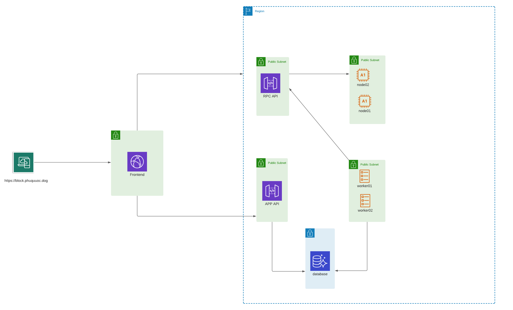

# Block explorer

This repo fork from `polkastats.io` build for Phu Quoc Dog Network

## Setup

See in directory docs.

## App Diagram

## 🤝 Contributing

Contributions, issues and feature requests are welcome!

Feel free to check [issues page](https://github.com/phuquocdog/block-explorer/issues). You can also take a look at the [contributing guide](CODE_OF_CONDUCT.md).

## Show your support

Give a ⭐️ if this project helped you!

## 📝 License

This project is [Apache-2.0](/LICENSE) licensed.